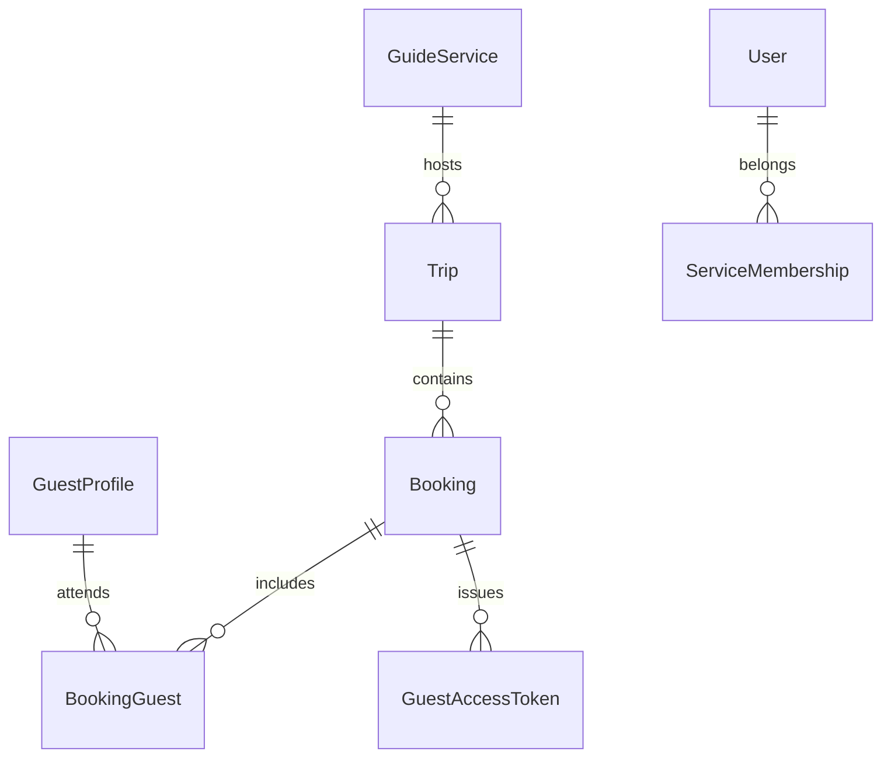

# Booking & Trip Workflows

This document covers the end‑to‑end lifecycle of a **booking** (reservation) and how it
interacts with trips, staffing, payments, guest information, and waivers.

The booking system must support both self‑serve guests and office staff while keeping
guide services in control of staffing and guest readiness.

---

## Entities & Relationships

```
GuideService ──< Trip ──< Booking ──< BookingGuest >── GuestProfile
                              |
                              └── BookingStatus (payment/info/waiver)
```

- A *GuideService* owns many trips and has service memberships (owner, manager, guide).
- A *Trip* belongs to one service and may have multiple bookings (corner case) as well as guide assignments.
- A *Booking* belongs to a trip, references a primary guest, and tracks status flags.
- *BookingGuest* links every attendee to the booking, allowing parties >1.
- *GuestProfile* is the canonical record for a guest (contact, emergency, medical info).
- *GuestAccessToken* provides magic-link access for guests (see `docs/design/guests.md`).

---

## Workflows

### Guest-driven (self-serve)
1. Guest browses public availability, selects a trip/date, and submits booking form.
2. System creates `Booking`, `GuestProfile` (or reuses existing), and injects any extra guests.
3. Emails are sent with:
   - Payment link (Stripe Checkout / Payment Intent).
   - Guest info link (magic link to `/guest?token=…`).
   - Waiver instructions.
4. Booking moves through statuses:
   - `payment_status`: `PENDING → PAID → REFUNDED` (if needed).
   - `info_status`: `PENDING → COMPLETE` (via guest portal or staff update).
   - `waiver_status`: `PENDING → SIGNED` (via webhook or manual mark).
5. Trip staffing may be automatic or manual (configurable per service). Unassigned trips appear in an “Needs guide” queue.

### Office-driven (staff-assisted)
1. Owner/manager collects booking data via admin UI.
2. They create a booking manually, filling in as much guest info as possible.
3. Customer receives the same emails/magic link sequence to finish payment, waivers, and remaining info.
4. Staff can adjust party size, add/remove guests, and re-send links.

### Staffing considerations
- Services can toggle whether bookings auto-assign a guide (based on availability rules) or request manual assignment.
- For manual services, highlight trips with `assignments.count() == 0`.
- Guides (role `GUIDE`) only see trips they’re assigned to; owners/managers see all trips for their service(s).

### Multiple bookings per trip (corner case)
- Default expectation is one booking per trip/time slot. However, for private/off-menu scenarios, allow multiple bookings:
  - Enforce capacity checks (`sum(party_size)` cannot exceed trip `capacity`).
  - Staff roster views must aggregate all booking guests for the trip.
  - Payment/info/waiver readiness should aggregate across bookings (all guests ready → trip ready).

---

## Booking States & Notifications

| Status type     | Values                       | Triggered by                                            |
|-----------------|------------------------------|---------------------------------------------------------|
| `payment_status`| `PENDING`, `PAID`, `REFUNDED`, `CANCELLED` | Stripe webhook or manual staff update                    |
| `info_status`   | `PENDING`, `COMPLETE`        | Guest portal update / staff edit                        |
| `waiver_status` | `PENDING`, `SIGNED`          | Waiver provider webhook or manual mark                  |

Notifications to send:
- Booking confirmation (immediately).
- Payment reminder (if payment still pending N days before trip).
- Info/waiver reminder (similar cadence).
- Post-trip follow-up (optional future enhancement).

Configuration per guide service:
- Turn self-serve bookings on/off.
- Choose autopilot staffing vs manual assignment.
- Choose reminder cadence (default templates provided).

---

## Guest Management Touch Points

### Staff UI Requirements
- Guests directory (see staff/guests UI):
  - Search by name/email.
  - View trip history, payment/waiver/info statuses.
  - Email magic link (calls `/api/guest-links/`).
- Trip roster view (future work):
  - Display all bookings & guests for a trip.
  - Highlight missing payments/waivers/info.
  - Provide quick action to resend guest link.

### Guest Portal (`/guest?token=…`)
- Pre-fill known data (name, phone, emergency contact, etc.).
- Allow updates, mark booking info complete upon save.
- Handle expired/invalid tokens gracefully.
- For parties >1: show note that other guests must be added via office, or allow editing additional guests (future iteration).

---

## Data Model Summary



- `GuestProfile`: email, names, phone, DOB, emergency contact, dietary/medical notes.
- `Booking`: references `Trip`, `primary_guest`, statuses, `party_size`, `last_guest_activity_at`.
- `BookingGuest`: join table with `is_primary`, so staff know who the main contact is.
- `GuestAccessToken`: hashed token, expiration date (set to trip end + 1 day by default), single-use toggle.

---

## Open Items & Future Enhancements
- **Multiple guests self-serve**: allow primary guest to add/remove party members in portal.
- **Payment balance**: support deposits, late balance payments, and partial refunds.
- **Trip capacity automation**: automatically prevent new bookings once capacity reached.
- **Guide scheduling**: integrate with availability calendar to auto-suggest guides.
- **Reporting**: export guest roster, waiver status, and payment summaries per trip.
- **Staff notifications**: alerts/slack/email when guests finish info/waiver or when bookings remain unstaffed.

Keep this document updated as workflows evolve and new requirements emerge.

