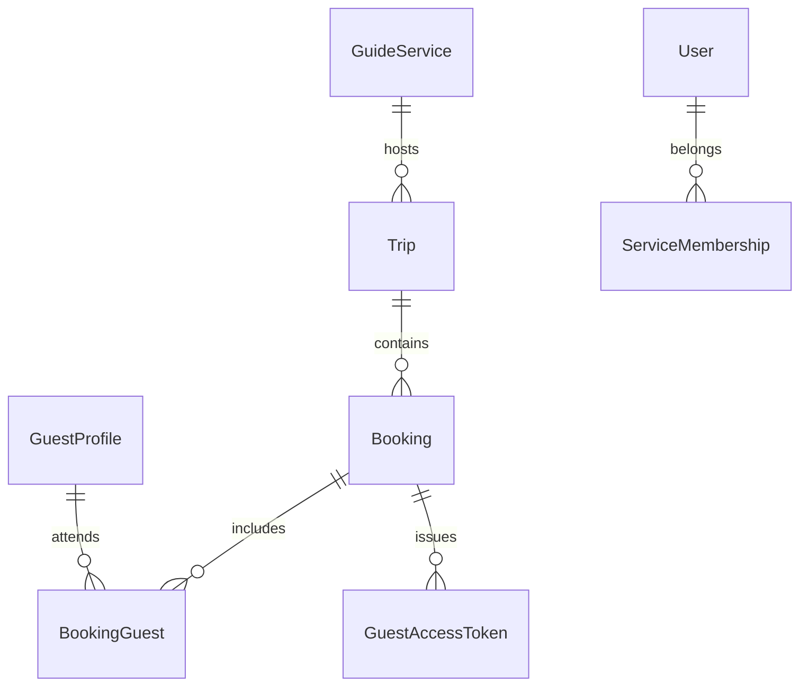

# Trip & Party Workflows

This document covers the end‑to‑end lifecycle of a guest **party** (the unit that pays and manages guest details) and how it
interacts with trips, staffing, payments, guest information, and waivers.

Internally the datastore still uses the `Booking` terminology; externally (UI, email copy, docs) we talk about **parties** so staff and guests experience a flatter “trip first” workflow.

The trip/party system must support both self‑serve guests and office staff while keeping
guide services in control of staffing and guest readiness.

---

## Entities & Relationships

```
GuideService ──< Trip ──< Party (Booking) ──< BookingGuest >── GuestProfile
                              |
                              └── PartyStatus (payment/info/waiver)
```

- A *GuideService* owns many trips and has service memberships (owner, manager, guide).
- A *Trip* belongs to one service and may have multiple parties (corner case) as well as guide assignments.
- A *Party* (stored as `Booking`) belongs to a trip, references a primary guest, and tracks status flags.
- *BookingGuest* links every attendee to the party, allowing parties >1.
- *GuestProfile* is the canonical record for a guest (contact, emergency, medical info).
- *GuestAccessToken* provides magic-link access for guests (see `docs/design/guests.md`).

---

## Workflows

### Guest-driven (self-serve)
1. Guest browses public availability, selects a trip/date, and submits the trip form.
2. System creates the trip’s party (`Booking`), `GuestProfile` (or reuses existing), and injects any extra guests.
3. Emails are sent with:
   - Payment link (Stripe Checkout / Payment Intent).
   - Guest info link (magic link to `/guest?token=…`).
   - Waiver instructions.
4. The party moves through statuses:
   - `payment_status`: `PENDING → PAID → REFUNDED` (if needed).
   - `info_status`: `PENDING → COMPLETE` (via guest portal or staff update).
   - `waiver_status`: `PENDING → SIGNED` (via webhook or manual mark).
5. Trip staffing may be automatic or manual (configurable per service). Unassigned trips appear in an “Needs guide” queue.

### Office-driven (staff-assisted)
1. Owner/manager collects trip details via the trip creation form (trip metadata + first party in one step).
2. They manage parties from the trip dashboard — the default view shows trip-level details and the primary party in one place.
3. Trip creation collects the first party and optionally assigns a lead guide in one step; an “Advanced” control allows staff to add additional parties to the same trip when separate groups need to manage details or payments independently.
4. Customers receive the same emails/magic link sequence to finish payment, waivers, and remaining info.
5. Staff can adjust party size, add/remove guests, and re-send links.

### Staffing considerations
- Services can toggle whether parties auto-assign a guide (based on availability rules) or request manual assignment.
- For manual services, highlight trips with `assignments.count() == 0`.
- Guides (role `GUIDE`) only see trips they’re assigned to; owners/managers see all trips for their service(s).

### Multiple parties per trip (corner case)
- Default expectation is one party per trip/time slot. However, for private/off-menu scenarios, allow multiple parties:
  - Enforce capacity checks (`sum(party_size)` cannot exceed trip `capacity`).
  - Staff roster views must aggregate all party guests for the trip.
  - Payment/info/waiver readiness should aggregate across parties (all guests ready → trip ready).

### Stripe integration mode
- Local development and automated tests run with a Stripe stub (`STRIPE_USE_STUB=true` or when `STRIPE_SECRET_KEY` is empty). The backend generates preview checkout links (`/payments/preview`) without reaching Stripe.
- To exercise real Stripe Checkout, set `STRIPE_USE_STUB=false` and provide a valid `STRIPE_SECRET_KEY`. The code path and tests remain identical aside from the gateway used.

---

## Party States & Notifications

| Status type     | Values                       | Triggered by                                            |
|-----------------|------------------------------|---------------------------------------------------------|
| `payment_status`| `PENDING`, `PAID`, `REFUNDED`, `CANCELLED` | Stripe webhook or manual staff update                    |
| `info_status`   | `PENDING`, `COMPLETE`        | Guest portal update / staff edit                        |
| `waiver_status` | `PENDING`, `SIGNED`          | Waiver provider webhook or manual mark                  |

Notifications to send:
- Party confirmation (immediately).
- Payment reminder (if payment still pending N days before trip).
- Info/waiver reminder (similar cadence).
- Post-trip follow-up (optional future enhancement).

Configuration per guide service:
- Turn self-serve parties on/off.
- Choose autopilot staffing vs manual assignment.
- Choose reminder cadence (default templates provided).

---

## Guest Management Touch Points

### Staff UI Requirements
- Guests directory (see staff/guests UI):
  - Search by name/email.
  - View trip history, payment/waiver/info statuses.
  - Email magic link (calls `/api/guest-links/`).
- Trip roster view (future work):
  - Display all parties & guests for a trip.
  - Highlight missing payments/waivers/info.
  - Provide quick action to resend guest link.
- Trip creation form queries `/api/trips/service/<service_id>/guides/` to offer an optional lead guide assignment.
- Trip management view allows managers to reassign their lead guide in-place; clearing the selection removes the assignment.

### Guest Portal (`/guest?token=…`)
- Pre-fill known data (name, phone, emergency contact, etc.).
- Allow updates, mark party info complete upon save.
- Handle expired/invalid tokens gracefully.
- For parties >1: show note that other guests must be added via office, or allow editing additional guests (future iteration).

---

## Data Model Summary



- `GuestProfile`: email, names, phone, DOB, emergency contact, dietary/medical notes.
- `Booking`: references `Trip`, `primary_guest`, statuses, `party_size`, `last_guest_activity_at`.
- `BookingGuest`: join table with `is_primary`, so staff know who the main contact is.
- `GuestAccessToken`: hashed token, expiration date (set to trip end + 1 day by default), single-use toggle.

---

## Open Items & Future Enhancements
- **Email notifications** drive much of this workflow. We will introduce a multi-tenant email layer:
  - Store per-service sender info (e.g., `notification_email`, display name, optional provider credentials) on `GuideService` or related table.
  - Use a transactional provider (Postmark, SendGrid, Mailgun, etc.) that supports unique from addresses per message.
  - Queue outbound email jobs (Celery/Redis or similar) so trip/party flows remain fast.
  - Maintain a template registry keyed by event type (booking_confirmation, payment_reminder, info/waiver reminder). Allow `GuideService` overrides.
  - Embed the guest magic link in all guest-facing emails; tokens expire one day after trip end.
  - Log each send (message id, provider response) for support/debugging.
  - Provide UI to manually resend links/notifications in the future.
- **Multiple guests self-serve**: allow primary guest to add/remove party members in portal.
- **Payment balance**: support deposits, late balance payments, and partial refunds.
- **Trip capacity automation**: automatically prevent new parties once capacity reached.
- **Guide scheduling**: integrate with availability calendar to auto-suggest guides.
- **Reporting**: export guest roster, waiver status, and payment summaries per trip.
- **Staff notifications**: alerts/slack/email when guests finish info/waiver or when parties remain unstaffed.

Keep this document updated as workflows evolve and new requirements emerge.
